# Create / distribute tiled map

## Taro Matsuzawa
### Georepublic Japan

---

# Notes

- This presentation use some command line tools
  - Open following link in your browser.
  - Copy and paste the command line to your terminal.

https://smellman.github.io/jica_2023/

---

# Self introduction

- GIS Engineer at Georepublic Japan
  - Programming: Python, JavaScript, TypeScript, Ruby etc.
  - UNIX and Linux guru
  - GIS skill: Data processing, Tiled based Map
- Community
  - Director of [OSGeo.JP](https://www.osgeo.jp/)
  - Director of [OpenStreetMap Foundation Japan](https://www.osmf.jp/)
  - Sub president of [Japan Unix Society](https://www.jus.or.jp/)
  - [UNOpenGIS/7](https://github.com/UNopenGIS/7) volunteer
- Contact: taro@georepublic.co.jp / @smellman on Twitter

---

# Today's agenda

- System setup
- What is tiled map?
- Introduction of software and data in this presentation
- How to create your own tiled map
- How to design your own tiled map
- How to distribute your own tiled map

---

# System setup

- This presentation requires Linux based OS.
  - Use Raspberry Pi 4.

---

# System setup - Connect to jump host

- Connect to SSID "vectortiles"
- Launch Terminal
  - Windows: Use PowerShell
  - Mac: Use Terminal.app
- Connect to Raspberry Pi with SSH

```PowerShell
ssh portal@j2213.local
```

---

# System setup - Connect to Your Raspberry Pi

```bash
make <YOUR HOST NAME>
```

e.g.

```bash
make m321
```

---

# System setup - Install software

```bash
sudo apt install -y git make
git clone https://github.com/smellman/jica_scripts.git
cd jica_scripts/system
sudo HOME=$HOME USER=$USER make install
```

---

# What is tiled map?

---

# Tile technology

- Provide map image or data over the internet.
  - Map images are separated as tiles.
  - Zoom Level 0 = World
  - Each zoom level doubles in the dimensions.
  - Too many tiles use "Web Mercator" projection.


https://a.tile.openstreetmap.org/0/0/0.png

---

# Useful to web

- Structure of tile is useful for web.
  - Enable to scroll map smoothly.
  - Enable to zoom up and zoom down map smoothly.
  - HTTP GET request.
- Tile become known for Google Maps.
  - Tile has existed from the late 1990s.

---

# Zoom

- Zoom level 0 : 1 file
- Zoom level 1 : 2 x 2 = 4 files
- Zoom level 2 : 4 x 4 = 16 files
- ...
- Zoom level 18 : 2^18 x 2^18 = 262,144 x 262,144 = 68,719,476,736 files


https://maps.gsi.go.jp/help/image/tileNum.png

---

# GET Request

- Many services use REST API(GET Request).
  - https://.../Z/X/Y.Format
  - Z: Zoom Level
  - X: X coordinate
  - Y: Y coordinate
  - Format: 
    - Raster image format(png, jpg, webp)
    - Vector data format(pbf, mvt)

---

# GET Request example

- https://a.tile.openstreetmap.org/3/2/4.png
  - Zoom = 3, X = 2, Y = 4, format = png
  - X and Y coordinates start with 0.


---

# Specification

- Two tile service specifications are popular.
  - Tile Map Service(TMS)
  - Web Map Tile Service(WMTS)
- TMS is simpler than WMTS.
- TMS's X Y coordinate is started from bottom left.
  - Same as Cartesian coordinate system.
- WMTS's X Y coordinate is started from top left.
  - Same as Coordinate system of 2D computer graphics.

---


---

# The Y coordinate flipped

- OpenStreetMap use TMS like protocol but Y coordinate is numbered from top.
  - OpenStreetMap call "Slippy Map".
  - We call xyz tile.
    - {z}/{x}/{y}.png
    - Also we call zxy tile.


https://maps.gsi.go.jp/help/image/tileNum.png

---

# XYZ tile

- De facto standard of tiled map.
  - Web Mercator projection
  - Y coordinate flipped TMS
  - Provide REST API
    - {z}/{x}/{y}.{format}
  - Anyone provide "Specification"
- Too many libraries support XYZ tile.
  - Leaflet, OpenLayers, Maplibre GL JS, Google Maps API etc.

---

# Raster tile (1/3)

- Provides "rendered image"
  - The image doesn't have any "data".
  - Focus to visualization.


---

# Raster tile (2/3)

- Provides "Satellite images" or "Aerial photograph"
  - Focus to photography.
  - The image doesn't have any "data" too.


---

# Raster tile (3/3)

- Provides "data" as image.
  - Focus to data.
    - Population, Temperature, Rainfall, Elevation, etc.
  - The image has "data" as color.
    - Sample raster tiles contain the elevation value obtainable by calculating with RGB values.


---

# Vector tile (1/2)

- Provides "Vector data"
  - Each tile contains "Vector data".
    - The tile like a data container.


---

# Vector tile (2/2)

- Vector tile doesn't have a style.
  - The client renders images with style settings.
    - Easy to rotation and bearing.
    - Supports 3D rendering.
- Programmable.
  - The client can change the style dynamically.

---

# Vector tile example - Multilingual

- https://openmaptiles.org/languages/
  - Enable to change main language dynamically.


---

# Vector tile example - Geospatial Information Authority of Japan

- https://maps.gsi.go.jp/vector/
  - GSI provides vector tile.
  - Enable to change style dynamically.


---

# Mapbox Vector Tile

- De facto standard of vector tile.
  - Vector tile specification by Mapbox Inc.
- Specification
  - A tile encoded by Protocol Buffer format.
  - Desinged for Web Mercator projection.
  - Supports Layers and Features.

https://docs.mapbox.com/data/tilesets/guides/vector-tiles-standards/

---

# Mapbox GL ecosystem and Style Specification

- Mapbox provides Mapbox GL JS(Web), Mapbox GL Native(Smartphone and Desktop application).
  - Mapbox provides specification of styling.
https://docs.mapbox.com/mapbox-gl-js/style-spec/


---

# Note: Mapbox GL is proprietary software

- Mapbox GL became proprietary software from end of 2020.
  - Mapbox GL JS is OpenSource software until v1.5.
  - Mapbox GL JS over v2 must require mapbox service’s token.
- MapLibre GL ecosystems are fork of mapbox OpenSource versions.
  - https://maplibre.org/
  - Highly recommend to use MapLibre GL JS now.

---

# Tile support libraries - Javascript

- Leaflet
  - https://leafletjs.com/
  - Lightweight and easy to use.
  - Supports Mapbox Vector Tile with plugin.
- OpenLayers
  - https://openlayers.org/
  - Difficult to use but powerful.
  - Supports Mapbox Vector Tile.
- MapLibre GL JS
  - https://maplibre.org/
  - Easy to use for Mapbox Vector Tile.
  - Supports raster xyz tile too.

---

# Tile support libraries - Android

- MapLibre GL Native
  - https://maplibre.org/
  - Easy to use for Mapbox Vector Tile.
  - Supports raster xyz tile too.
- Google Maps SDK
  - https://developers.google.com/maps/documentation/android-sdk/overview
  - Easy to use for raster xyz tile.

---

# Tile support libraries - iOS

- MapLibre GL Native
  - https://maplibre.org/
  - Easy to use for Mapbox Vector Tile.
  - Supports raster xyz tile too.
- Mapkit
  - https://developer.apple.com/documentation/mapkit
  - Easy to use for raster xyz tile.

---

# Desktop application

- QGIS
  - https://qgis.org/
  - Supports raster xyz tile.
  - Supports Mapbox Vector Tile.

---

# Introduction of software and data in this presentation

---

# Requirements

- This presentation requires Linux based OS.
- Also, you can use Raspberry Pi 4.
  - Raspberry Pi 4 is cheap and powerful.
  - Raspberry Pi 4 is ARM64/aarch64 architecture.
  - Raspberry Pi 4 is easy to use for GIS.
- My repository for this presentation supports only ARM64/aarch64 architecture.

---

# Software - GDAL/OGR

- https://gdal.org/
- GDAL/OGR is the most popular GIS library and provides command line tools.
  - QGIS based on GDAL/OGR.
- GDAL/OGR supports many GIS data formats.
- GDAL/OGR supports raster xyz tile.

---

# Software - Tippecanoe

- https://github.com/felt/tippecanoe/
- Build vector tilesets from large (or small) collections of GeoJSON, FlatGeoBuf or CSV features.
- Tippecanoe is the most popular vector tile builder.

---

# Software - Charites

- Command line tool for writing Mapbox/MapLibre Vector Style Specification in YAML.
  - Organized by The United Nation Vector Tile Toolkit(UNVT).
- Charites convert Style Specification(JSON) to YAML.
  - YAML is easy to read and write for human.
  - YAML is easy to edit for beginners.
- Charites enable to dynamic serving style.


---

# Software - editor

- `nano` is a simple text editor.
  - nano is easy to use for both beginners.
- `vim` is a powerful text editor.
  - vim is difficult to use for beginners.
  - vim is easy to use for experts.

---

# Software - make

- make is a build automation tool.
- make is easy to use for both beginners and experts.
- make is a standard tool of UNIX and Linux.
  - This presentation use make for build and deploy.

---

# Software - nginx

- nginx is a web server.
- nginx is easy to use for both beginners and experts.
- nginx is a standard tool of UNIX and Linux.
  - This presentation use nginx for serving tiles.

---

# Software - tileserver-gl-light

- tileserver-gl-light is a vector tile server.
- useful for inspecting vector tile.

---

# Software - docker

- docker is a container platform.
- docker is easy to use for both beginners and experts.
- This presentation use docker for serving tiles or running tileserver-gl-light.

---

# Data - Global Map

- Digital geographic information
  - Provided by International Steering Committee for Global Mapping(ISCGM).
  - Composed of 8 Data Sets
    - Vector Data (Transportation, Boundaries, Darainage, Population Centre)
    - Raster Data (Elevation, Vegetation, Land Cover, Land Use)
- Free for non-commercial use.

---

# Global Map - archive

- Archives and website were moved into github by GSI.
  - https://github.com/globalmaps
  - https://globalmaps.github.io/
- Old website was closed
- Some countries provides global map archives at the national site.
  - All links: https://github.com/globalmaps/projectmanagement/blob/master/REPOS.md
- Some links are dead now.

---

# Global map – format

- Vector data provide as Shapefile.
  - It provided as Geography Markup Language (GML)
format.
- Raster data provide as GeoTiff file.
  - It provided as Band interleaved by line (BIL) format.

---

# Data – Aerial photograph

- https://www.mlit.go.jp/plateau/
- In Japan, Plateau Project release too many Aerial photograph data.
  - Plateau released PointCloud, 3D data, and Aerial photograph.
  - Aerial photograph is released as GeoTiff data. 
    - It is good sample to create raster tile.

---

# Data - OpenStreetMap

- https://www.openstreetmap.org/
- OpenStreetMap is the most popular OpenData.
  - OpenStreetMap provides planet data as PBF format.
- Today's presentation use OpenStreetMap data as sample data.
  - Use small area data for easy to understand.

---

# Data for this presentation

- Global Map Sri Lanka 1.0
  - https://github.com/globalmaps/gmlk10
- Global Map Sri Lanka 2.0
  - https://github.com/globalmaps/gmlk20
- Plateau Higashimurayama City in Tokyo GeoTIFF
  - https://www.geospatial.jp/ckan/dataset/plateau-13213-higashimurayama-shi-2020
- OpenStreetMap data
  - https://tile.opensteetmap.jp/static/planet.pmtiles


---

# How to create your own tiled map

---

# Raster tile processing pattern 1: Global map (One GeoTIFF file)

- Download GeoTIFF file from Global Map archive.
- Enable transparency.
- Convert GeoTIFF to XYZ tile using gdal2tiles.

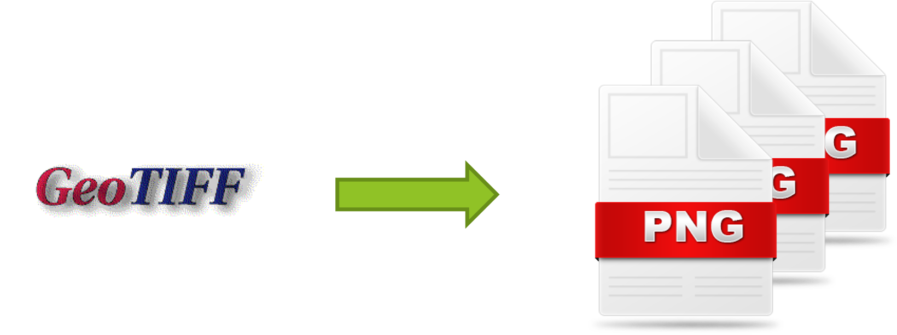

---

# How to process

```bash
cd ~/jica_scripts/raster_tile_gm
make fetch # Download GeoTIFF file from Global Map archive.
make transparent # Enable transparency.
make generate_tile # Convert GeoTIFF to XYZ tile using gdal2tiles.
make serve # run nginx
```

---

# How to read Makefile

```Makefile
fetch:
        git clone https://github.com/globalmaps/gmlk10.git

transparent:
        gdalbuildvrt -srcnodata "0 0 99" el.vrt gmlk10/el.tif

generate_tile:
        gdal_translate -of vrt -expand rgba el.vrt temp.vrt
        gdal2tiles.py --xyz -s EPSG:4326 -z 0-11 temp.vrt

serve:
        docker run -p 8080:80 -v $(PWD)/temp:/usr/share/nginx/html:ro nginx
```

Makefile is simple to run tasks.

```Makefile
task_name:
        command
```

---

# Result

Access to http://<your host>.local:8080/leaflet.html

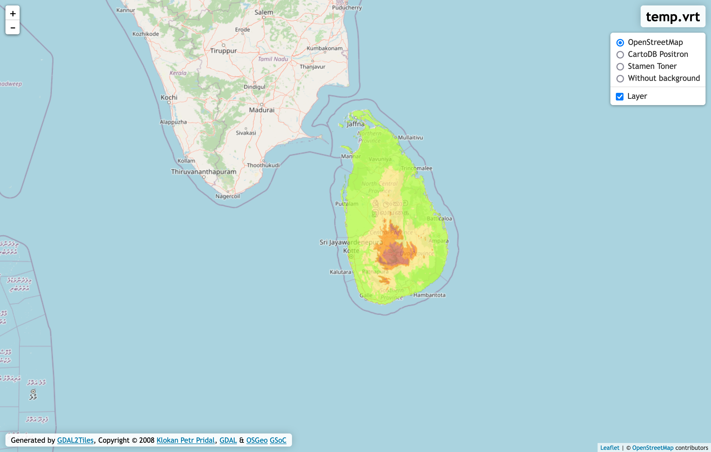

---

# Raster tile processing pattern 2: Plateau (Many GeoTIFF files)

- Generate VRT file from GeoTIFF files.
- Convert VRT file to XYZ tile using gdal2tiles.

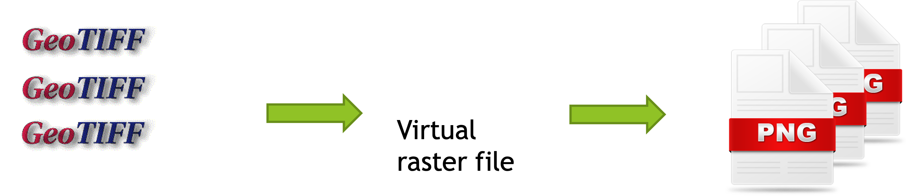

---

# How to process

```bash
cd ~/jica_scripts/raster_tile_plateau
make fetch # Download GeoTIFF file from Plateau archive and unarchive
make buildvrt # Generate VRT file from GeoTIFF files.
make generate_tile # Convert VRT file to XYZ tile using gdal2tiles.
make serve # run nginx
```

---

# Result

Access to http://<your host>.local:8080/leaflet.html


---

# Vector tile processing pattern: Global map

- Download Shapefile file from Global Map archive.
- Convert Shapefile to GeoJSON using ogr2ogr.
- Convert GeoJSON to Mapbox Vector Tile using tippecanoe.

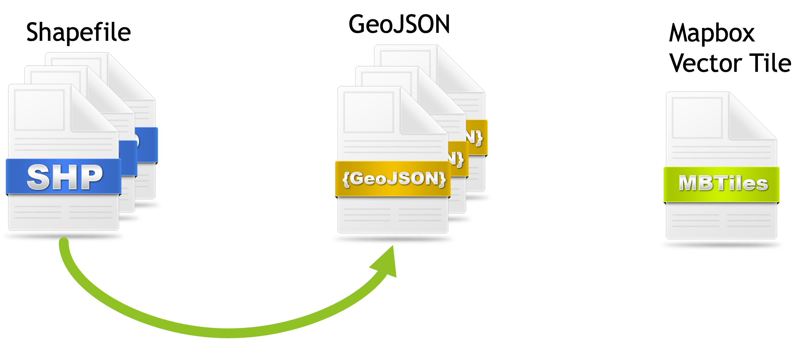

---

# How to process

```bash
make fetch # Download Shapefile file from Global Map archive.
make convert # Convert Shapefile to GeoJSON using ogr2ogr.
make generate # Convert GeoJSON to Mapbox Vector Tile using tippecanoe.
make tileserver-gl # run tileserver-gl-light
```

---

# Result

Access to http://<your host>.local:8081/

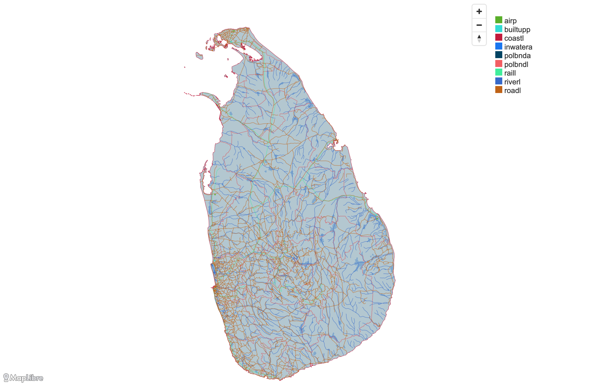

---

# Makefile (1/3)

```Makefile
fetch:
	git clone https://github.com/globalmaps/gmlk20.git

convert:
	cd gmlk20; \
	ogr2ogr airp_lka.geojson -s_srs EPSG:4326 -t_srs EPSG:4326 airp_lka.shp; \
	ogr2ogr builtupp_lka.geojson -s_srs EPSG:4326 -t_srs EPSG:4326 builtupp_lka.shp; \
	ogr2ogr coastl_lka.geojson -s_srs EPSG:4326 -t_srs EPSG:4326 coastl_lka.shp; \
	ogr2ogr inwatera_lka.geojson -s_srs EPSG:4326 -t_srs EPSG:4326 inwatera_lka.shp; \
	ogr2ogr polbnda_lka.geojson -s_srs EPSG:4326 -t_srs EPSG:4326 polbnda_lka.shp; \
	ogr2ogr polbndl_lka.geojson -s_srs EPSG:4326 -t_srs EPSG:4326 polbndl_lka.shp; \
	ogr2ogr raill_lka.geojson -s_srs EPSG:4326 -t_srs EPSG:4326 raill_lka.shp; \
	ogr2ogr riverl_lka.geojson -s_srs EPSG:4326 -t_srs EPSG:4326 riverl_lka.shp; \
	ogr2ogr roadl_lka.geojson -s_srs EPSG:4326 -t_srs EPSG:4326 roadl_lka.shp
```

---

# 9 outputs

- ogr2ogr convert Shapefile to GeoJSON.
  - Notes: Those Shapefiles are not included .prj file.

---

# Makefile (2/3)

```
generate:
	tippecanoe -o lka.pmtiles \
	  -L airp:gmlk20/airp_lka.geojson \
	  -L builtupp:gmlk20/builtupp_lka.geojson \
	  -L coastl:gmlk20/coastl_lka.geojson \
	  -L inwatera:gmlk20/inwatera_lka.geojson \
	  -L polbnda:gmlk20/polbnda_lka.geojson \
	  -L polbndl:gmlk20/polbndl_lka.geojson \
	  -L raill:gmlk20/raill_lka.geojson \
	  -L riverl:gmlk20/riverl_lka.geojson \
	  -L roadl:gmlk20/roadl_lka.geojson
	tippecanoe -o lka.mbtiles \
	  -L airp:gmlk20/airp_lka.geojson \
	  -L builtupp:gmlk20/builtupp_lka.geojson \
	  -L coastl:gmlk20/coastl_lka.geojson \
	  -L inwatera:gmlk20/inwatera_lka.geojson \
	  -L polbnda:gmlk20/polbnda_lka.geojson \
	  -L polbndl:gmlk20/polbndl_lka.geojson \
	  -L raill:gmlk20/raill_lka.geojson \
	  -L riverl:gmlk20/riverl_lka.geojson \
	  -L roadl:gmlk20/roadl_lka.geojson
```

---

# 2 outputs

- tippecanoe runs 2 times and generate 2 outputs.
  - .mbtiles file
    - SQLite database file.
    - Contains vector tile.
  - .pmtiles file
    - "Cloud Native" format.
    - You can host .pmtiles as static file.

---

# MBTiles - SQLite database

- MBTiles is container of tile.
  - MBTiles is single file database(SQLite).
  - TMS schema.

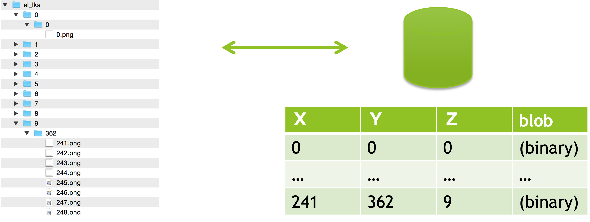

---

# Makefile (3/3)

```Makefile
tileserver-gl:
	docker run --rm -it -v $(PWD):/data -p 8080:80 \
	  maptiler/tileserver-gl-light \
	  -p 80 --file /data/lka.mbtiles
```

---

# PMTiles - Cloud Native format

- PMTiles is similar to MBTiles.
  - "Cloud Native" format.
  - You can easy to convert mbtiles to pmtiles using `pmtiles` command.

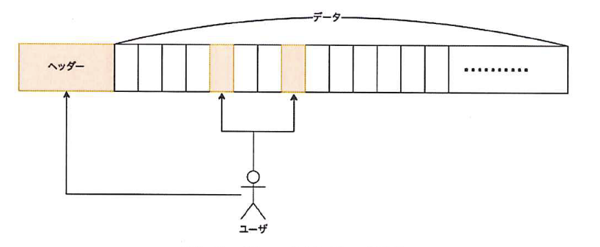

https://smellman.github.io/pmtiles-example/

---

# How to design your own tiled map

---

# Design tiled map

- Vector tile doesn't have a style.
  - The client renders images with style settings.
- In this presentation, we use `charites` to design tiled map.
  - Charites convert Style Specification(JSON) to YAML.
  - YAML is easy to read and write for human.
  - YAML is easy to edit for beginners.

---

# Try to edit style

```bash
cd ~/jica_scripts/vector_tile
make practice
```
Open http://<your host>.local:8080/ in your browser.

Open other terminal and run following command.

```bash
cd ~/jica_scripts/vector_tile
nano style-practice.yml
```

---

# nano

- nano is a simple text editor.
  - nano is easy to use for begineer.
- Ctrl + O: Save file
- Ctrl + X: Exit nano

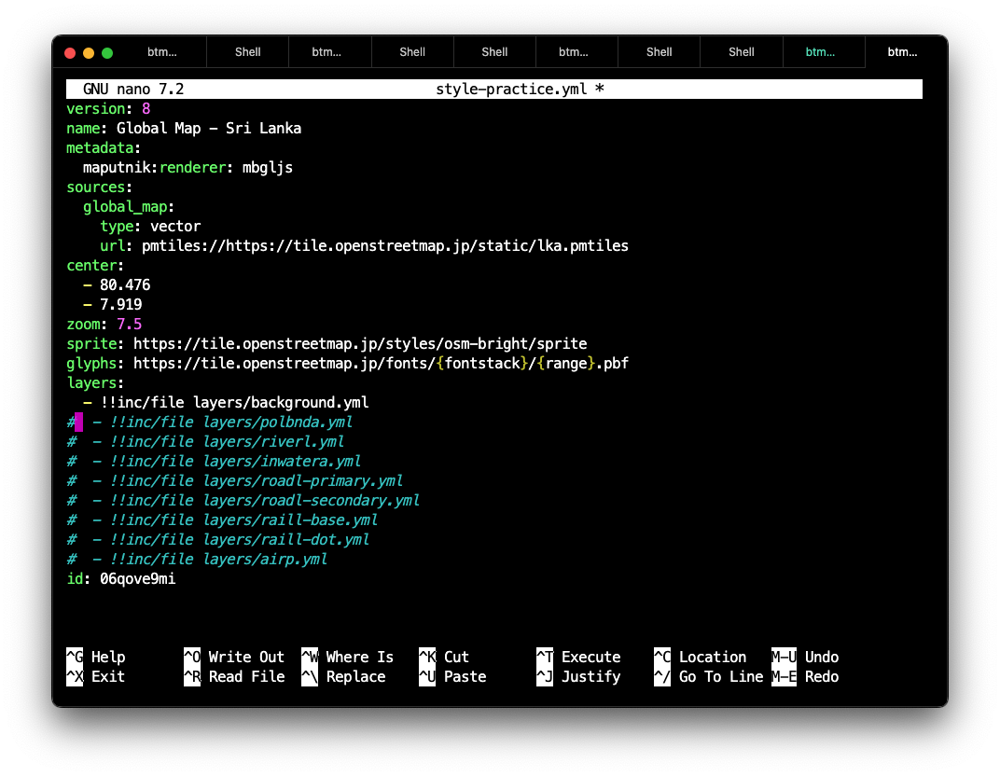

---

# Remove comments on layers

Remove comments in style-practice.yml.

```yaml
layers:
  - !!inc/file layers/background.yml
#  - !!inc/file layers/polbnda.yml
#  - !!inc/file layers/riverl.yml
#  - !!inc/file layers/inwatera.yml
#  - !!inc/file layers/roadl-primary.yml
#  - !!inc/file layers/roadl-secondary.yml
#  - !!inc/file layers/raill-base.yml
#  - !!inc/file layers/raill-dot.yml
#  - !!inc/file layers/airp.yml
```

---

# Layers in Maplibre Style Specification

- Background
- Fill
- Line
- Symbol
- Circle
- Raster
- Hillshade
- Fill Extrusion
  - It used for 3D rendering.

https://maplibre.org/maplibre-style-spec/

---

# Background layer

```yaml
id: background
type: background
paint: 
  background-color: rgb(0,0,0)
```

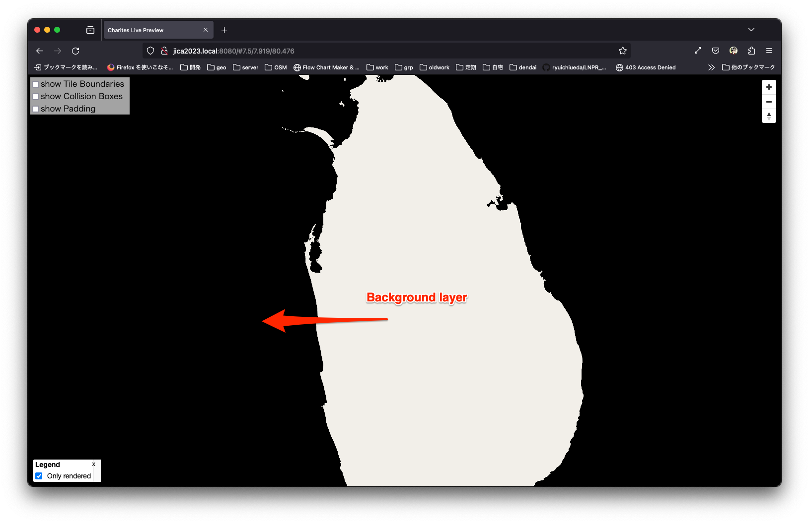

---

# Fill layer

```yaml
id: polbnda
type: fill
source: global_map
source-layer: polbnda
paint:
  fill-color: '#f2efe9'
```

- source: global_map means "global_map" source in sources section.
- source-layer: polbnda means "polbnda" layer in global_map source.

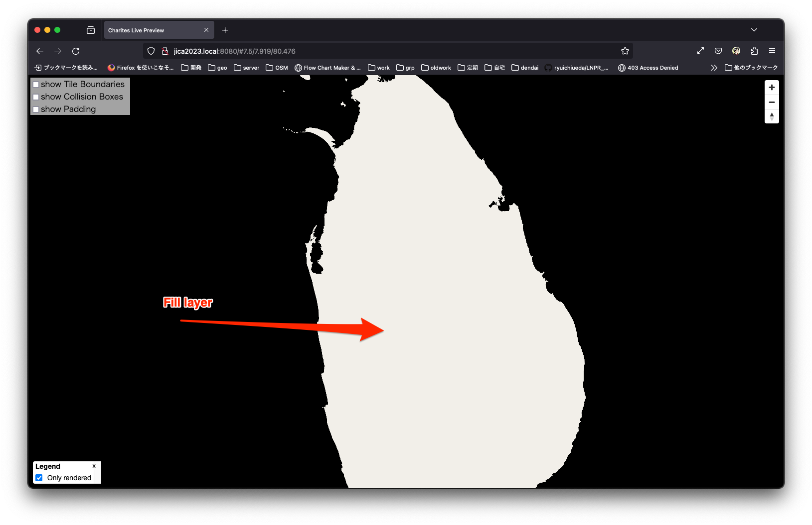

---

# Line layer

```yaml
id: riverl
type: line
source: global_map
source-layer: riverl
paint:
  line-color: rgb(0,0,255)
  line-width:
    base: 1
    stops:
      - - 6
        - 0.5
      - - 10
        - 2
```

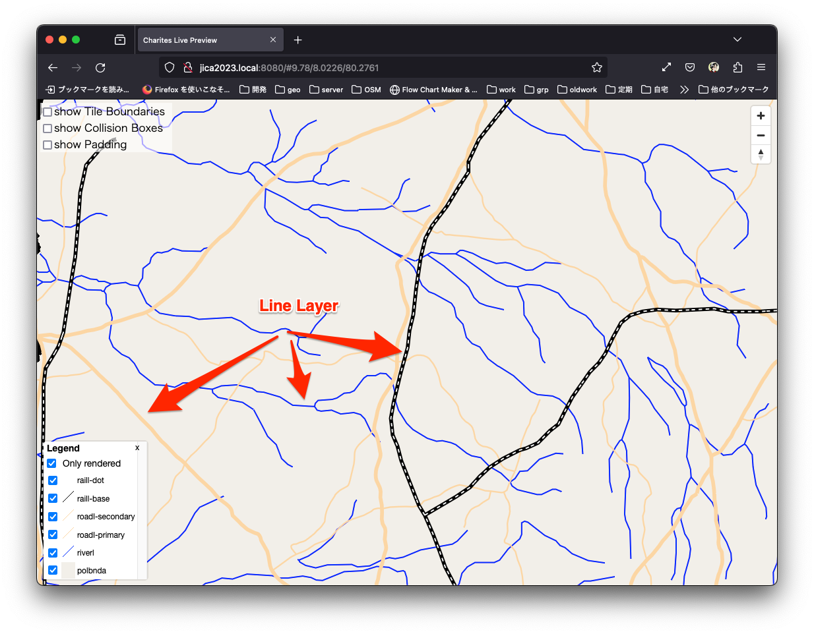

---

# Line layer

- Draw line with polyline features.
  - Normal line.
  - Dash-array line.
    - Following example is Normal line + Dash-array line.
  
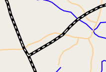

---

# Filter

roadl-primary.yml and roadl-secondary.yml use filter.

roadl-primary.yml use following filter.

```yaml
filter:
  - all
  - - '=='
    - rtt
    - '14'
```

'rtt' is a field name in roadl layer and '14' is primary route.

---

# Zoom function

- Zoom function is useful to change style dynamically.
  - Set Zoom 6 to 1 and Zoom 10 to 6, the value will increase between Zoom 6 and 10.
- "base" property will use to control the rate which the function output increases.
  - "base = 1" will be increased linearly.

https://maplibre.org/maplibre-style-spec/expressions/

---

# Symbol layer

```yaml
id: airp
type: symbol
source: global_map
source-layer: airp
layout:
  icon-image: airport_11
  text-field: '{nam}'
  text-offset:
    - 0
    - 0.6
```

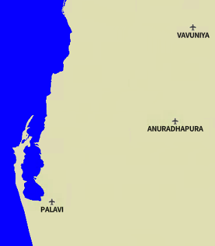

---

# Symbol layer

- Draw symbol with point features.
  - Icon
  - Text
  - Text with icon
- Allow Point, Polygon and Polyline features.

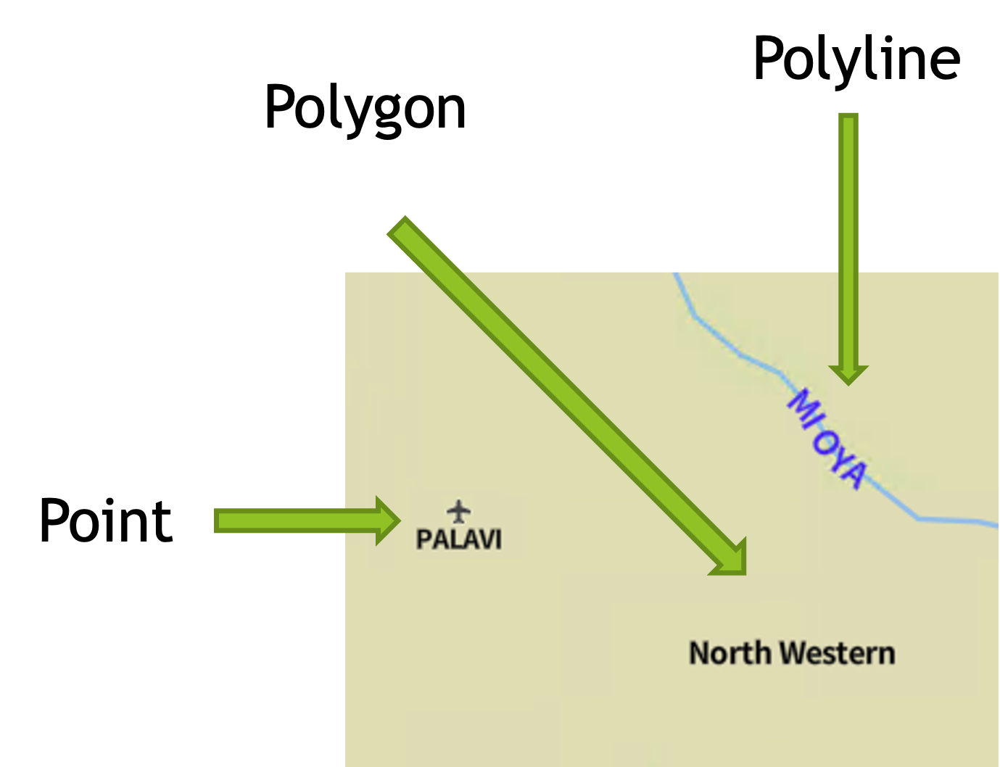

---

# icon-image and text-field

- icon-image is a property of symbol layer.
  - icon-image is a name of icon.
    - icon-image is defined in sprite.
- text-field is a property of symbol layer.
  - text-field is a name of field in source data.
    - It can use Feature Properties using {field_name}.

---

# text-offset

- text-offset is a property of symbol layer.
  - text-offset is a offset of text.
    - It can use array of [x, y].
    - x and y are offset from center of point.

```yaml
layout:
  icon-image: airport_11
  text-field: '{nam}'
  text-offset:
    - 0
    - 0.6
```

---

# Convert your style via charites

Stop `make practice` command and run following command.

```bash
make build
```

`Makefile` is simple to run tasks.

```Makefile
build:
  charites convert style-practice.yml style-practice.json
```

---

# Result

```bash
make serve
```

Open http://<your host>.local:8080/ in your browser.

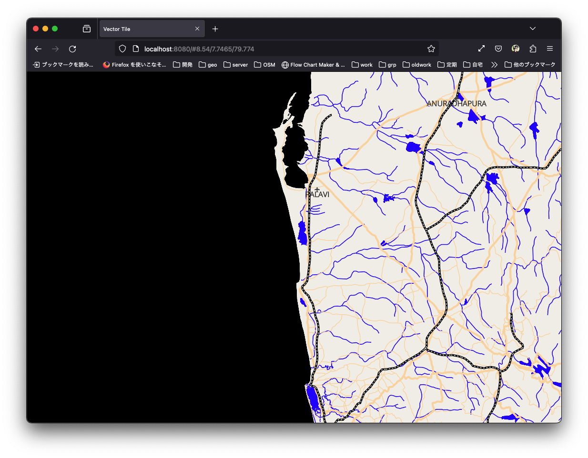

--- 

# How to distribute your own tiled map

---

# Raster tile hosting (1)

- If you use small number of data only, hosting as static image is easy.
  - Use nginx or Apache HTTP Server.
  - Use AWS S3 or Google Cloud Storage.
  - Github Pages is good for small data and free.
    - Be careful to license of tile images.

https://docs.github.com/en/pages/getting-started-with-github-pages/about-github-pages

---

# Raster tile hosting (2)

- If you use large number of data, be careful to hosting.
  - File system limitation: max number of files.
    - Ext4 on Linux: 4,294,967,295 files(specified at filesystem creation time)
  - File copy will take a long time.
  - MBTiles is a solution to hosting large number of data.
    - MBUtil is useful to create .mbtiles from tile images.

```bash
mb-util temp/ el.mbtiles 
```

---

# Vector tile hosting - tileserver-gl

- Tileserver GL is useful.
  - But vector tiles needs SSL access in internet.
  - Let's encrypt is useful to get SSL certificate.
    - https://letsencrypt.org/
  - Setup frontend server(Apache/nginx/etc) and connect from server with reverse proxy.

---

# Overview - nginx

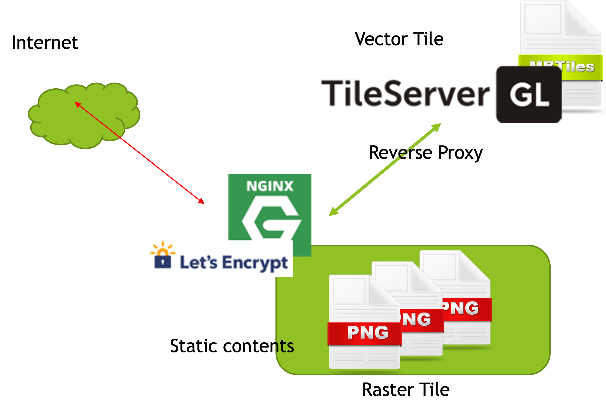

--- 

# Reverse proxy setting

- Nginx is easy to setup reverse proxy.

```nginx
location / {
    proxy_set_header X-Forwarded-Proto https;
    proxy_set_header X-Forwarded-For $proxy_add_x_forwarded_for;
    proxy_set_header Host $http_host;
    proxy_pass http://localhost:8080;
}
```

---

# Server-side rendering

- Tileserver GL can deliver raster tile if you host style.
  - But rendering is slow.
    - If you use this function, you should use cache server.

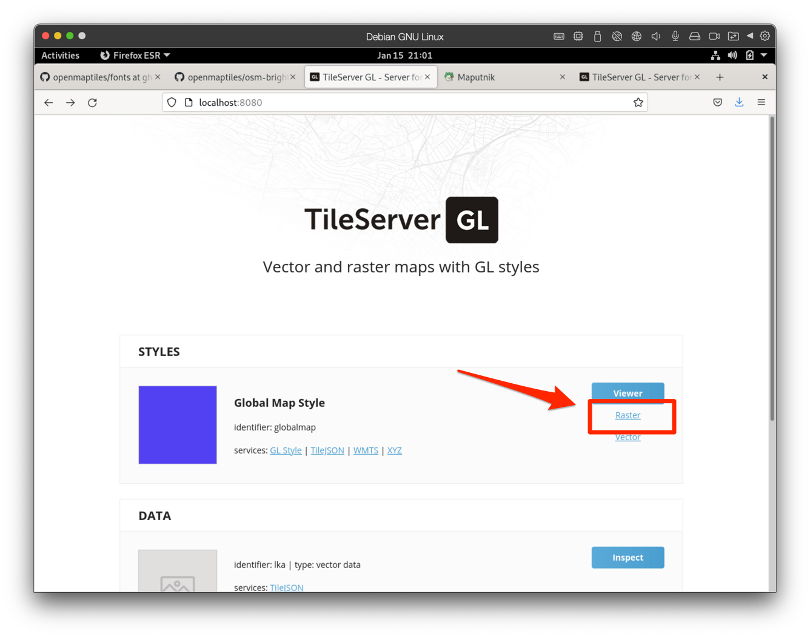

---

# Tileserver GL - cache

- Use varnish cache for raster rendering.
  - https://varnish-cache.org/
- https://tile.openstreetmap.jp/ use varnish cache.
  - 20 processs run.
  - 20Core CPU and 64GB RAM.

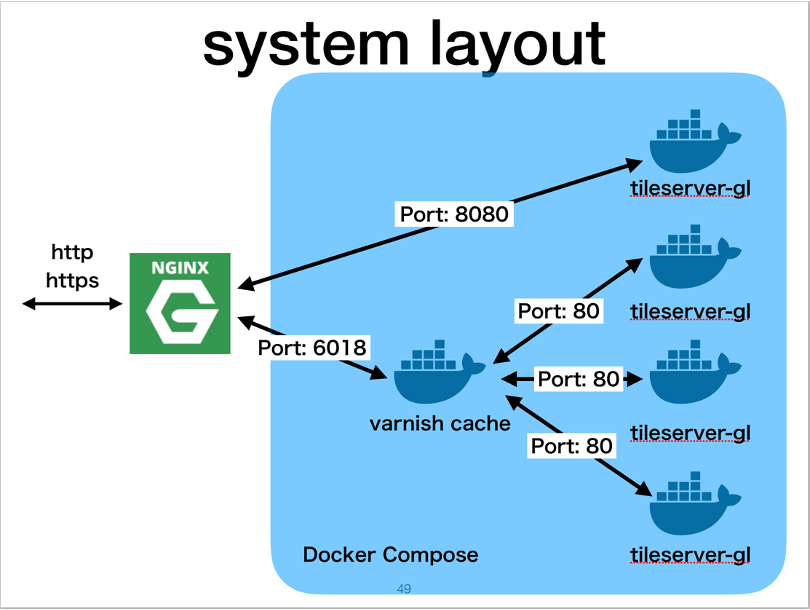

---

# Vector tile hosting - pmtiles

- PMTiles is useful to hosting vector tile.
  - PMTiles is "Cloud Native" format.
  - PMTiles is easy to host as static file.
    - Nginx / Apache / AWS S3 / Google Cloud Storage etc.

https://github.com/protomaps/PMTiles

---

# PMTiles nginx setting - CORS setting

```nginx
add_header 'Access-Control-Allow-Origin' "$http_origin" always;
add_header 'Access-Control-Allow-Credentials' 'true' always;
add_header 'Access-Control-Allow-Methods' 'GET, POST, PUT, DELETE, OPTIONS' always;
add_header 'Access-Control-Allow-Headers' 'Accept,Authorization,Cache-Control,Content-Type,DNT,If-Modified-Since,Keep-Alive,Origin,Range,User-Agent,X-Requested-With' always;

if ($request_method = 'OPTIONS') {
  # Tell client that this pre-flight info is valid for 20 days
  add_header 'Access-Control-Allow-Origin' "$http_origin" always;
  add_header 'Access-Control-Allow-Headers' 'Accept,Authorization,Cache-Control,Content-Type,DNT,If-Modified-Since,Keep-Alive,Origin,Range,User-Agent,X-Requested-With' always;
  add_header 'Access-Control-Max-Age' 1728000;
  add_header 'Content-Type' 'text/plain charset=UTF-8';
  add_header 'Content-Length' 0;
  return 204;
}
```

see: https://github.com/smellman/pmtiles-example

---

# Static hosting usecase - IPFS

- IPFS is a peer-to-peer hypermedia protocol.
  - https://ipfs.tech/
- IPFS is useful to hosting static files.
  - IPFS is useful to hosting PMTiles.

---

# IPFS - How to start daemon

```bash
cd ~/jica_scripts/system
make ipfs-init
make ipfs-daemon
```

---

# IPFS - How to add file

```bash
cd ~/jica_scripts/vector_tile
make ipfs
```

Output `CID` is IPFS Content Identifier.

```
added QmRSsj5FstJt8Rvrvp4GKG4i77yRredn8eHAuYoNkKhWpW lka.pmtiles
```

---

# IPFS - How to access

Copy CID, then.

```bash
nano style-ipfs.yml
```

Paste CID to `sources` section.

```yaml
sources:
  global_map:
    type: vector
    url: >-
      pmtiles://https://smb.optgeo.org/ipfs/<Your CID>
```

https://smb.optgeo.org/ipfs/ is IPFS gateway server running by Hidenori Fujimura.

---

# IPFS - How to access


```bash
cd ~/jica_scripts/vector_tile
make build-ipfs
make serve
```

Open http://<your host>.local:8080/index-ipfs.html in your browser.

---

# copyright

- This presentation is licensed under [CC BY 4.0](https://creativecommons.org/licenses/by/4.0/).
- All pictures with OpenStreetMap images are licensed under [CC BY-SA 2.0](https://creativecommons.org/licenses/by-sa/2.0/).
  - © OpenStreetMap contributors
