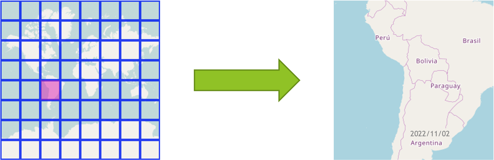
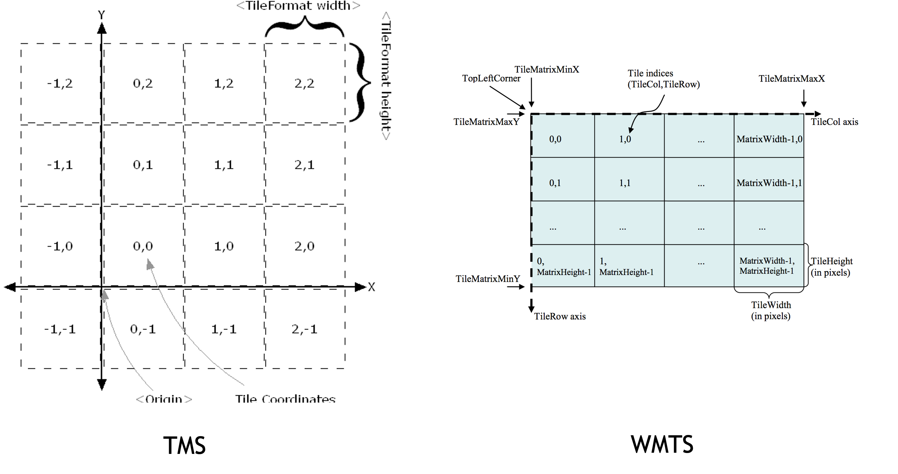
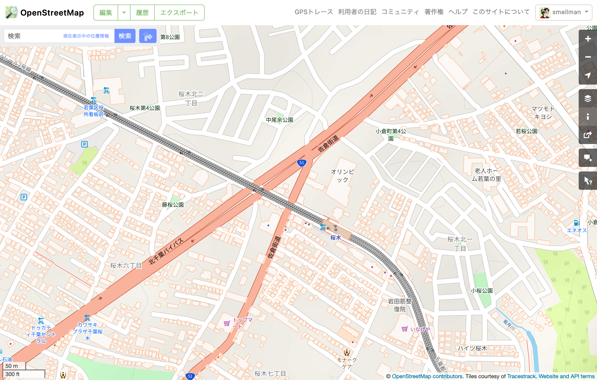
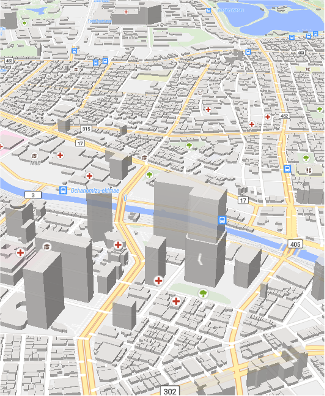
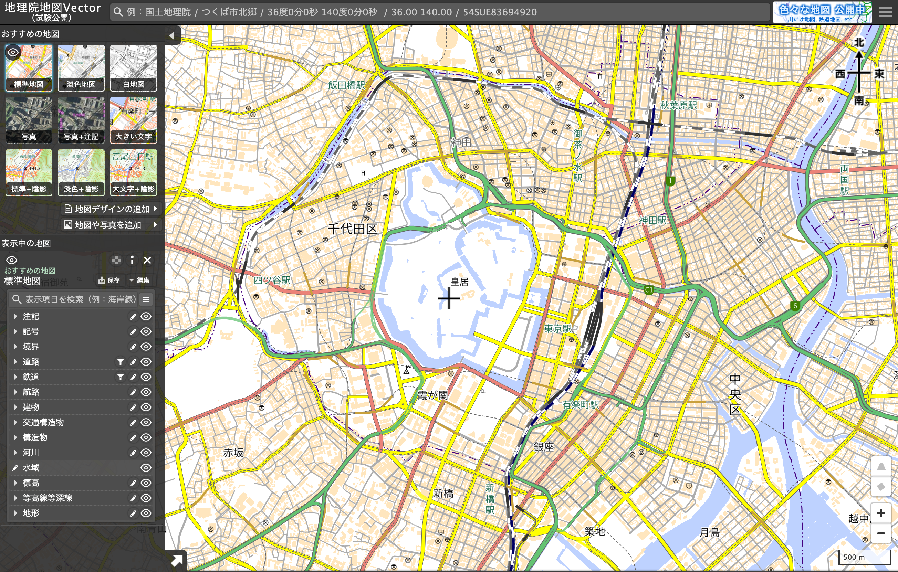
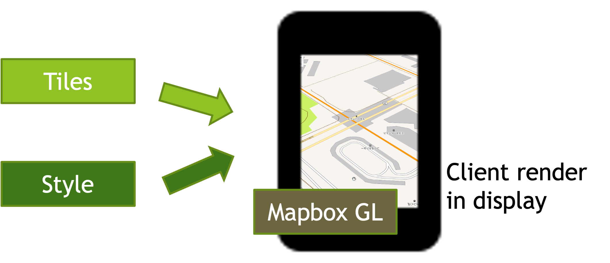

# Create / distrubute tiled map

## Taro Matsuzawa
### Georepublic Japan

---

# Notes (1/2)

- This presentation use some links to external resources
  - Please download the presentation from the link below


---

# Notes (2/2)

- This presentation is written in Markdown
  - You can edit this presentation with any text editor
  - You can convert this presentation to PDF or PowerPoint, please see the README.md
  - You can download the presentation of auto generate versions from the link below
    - [PDF](https://smellman.github.io/jica_2023/jica-seminar-2023.pdf)
    - [PowerPoint](https://smellman.github.io/jica_2023/jica-seminar-2023.pptx)
    - [HTML](https://smellman.github.io/jica_2023/)

---

# Self introduction

- GIS Engineer at Georepublic Japan
  - Programming: Python, JavaScript, TypeScript, Ruby etc.
  - UNIX and Linux guru
  - GIS skill: Data processing, Tiled based Map
- Community
  - Director of [OSGeo.JP](https://www.osgeo.jp/)
  - Director of [OpenStreetMap Foundation Japan](https://www.osmf.jp/)
  - Sub president of [Japan Unix Society](https://www.jus.or.jp/)
  - [UNOpenGIS/7](https://github.com/UNopenGIS/7) volunteer
- Contact: taro@georepublic.co.jp / @smellman on Twitter

---

# Today's agenda

- System setup
- What is tiled map?
- Introduction of software and data in this presentationå
- How to create your own tiled map
- How to design your own tiled map
- How to distribute your own tiled map

---

# System setup

- This presentation requires Linux based OS.
  - Use Raspberry Pi 4.

---

# System setup - Connect to jump host

- Connect to SSID "jica2023" # TODO change SSID
- Launch Terminal
  - Windows: Use PowerShell
  - Mac: Use Terminal.app
- Connect to Raspberry Pi with SSH

```PowerShell
ssh portal@j2213.local
```

---

# System setup - Connect to Your Raspberry Pi

```bash
make <YOUR HOST NAME>
```

e.g.

```bash
make m321
```

---

# System setup - Install software

```bash
sudo apt install -y git make
git clone https://github.com/smellman/jica_scripts.git
cd jica_scripts/system
sudo HOME=$HOME USER=$USER make install
```

---

# What is tiled map?

---

# Tile technology

- Provide map image or data over the internet.
  - Map images are separated as tiles.
  - Zoom Level 0 = World
  - Each zoom level doubles in the dimensions.
  - Too many tiles use "Web Mercator" projection.


https://a.tile.openstreetmap.org/0/0/0.png

---

# Useful to web

- Structure of tile is useful for web.
  - Enable to scroll map smoothly.
  - Enable to zoom up and zoom down map smoothly.
  - HTTP GET request.
- Tile become known for Google Maps.
  - Tile has existed from the late 1990s.

---

# Zoom

- Zoom level 0 : 1 file
- Zoom level 1 : 2 x 2 = 4 files
- Zoom level 2 : 4 x 4 = 16 files
- ...
- Zoom level 18 : 2^18 x 2^18 = 262,144 x 262,144 = 68,719,476,736 files


https://maps.gsi.go.jp/help/image/tileNum.png

---

# GET Request

- Many services use REST API(GET Request).
  - https://.../Z/X/Y.Format
  - Z: Zoom Level
  - X: X coordinate
  - Y: Y coordinate
  - Format: 
    - Raster image format(png, jpg, webp)
    - Vector data format(pbf, mvt)

---

# GET Request example

- https://a.tile.openstreetmap.org/3/2/4.png
  - Zoom = 3, X = 2, Y = 4, format = png
  - X and Y coordinates start with 0.



---

# Specification

- Two tile service specifications are popular.
  - Tile Map Service(TMS)
  - Web Map Tile Service(WMTS)
- TMS is simpler than WMTS.
- TMS's X Y coordinate is started from bottom left.
  - Same as Cartesian coordinate system.
- WMTS's X Y coordinate is started from top left.
  - Same as Coordinate system of 2D computer graphics.

---



---

# The Y coordinate flipped

- OpenStreetMap use TMS like protocol but Y coordinate is numbered from top.
  - OpenStreetMap call "Slippy Map".
  - We call xyz tile.
    - {z}/{x}/{y}.png
    - Also we call zxy tile.


https://maps.gsi.go.jp/help/image/tileNum.png

---

# XYZ tile

- De facto standard of tiled map.
  - Web Mercator projection
  - Y coordinate flipped TMS
  - Provide REST API
    - {z}/{x}/{y}.{format}
  - Anyone provide "Specification"
- Too many libraries support XYZ tile.
  - Leaflet, OpenLayers, Maplibre GL JS, Google Maps API etc.

---

# Raster tile (1/3)

- Provides "rendered image"
  - The image doesn't have any "data".
  - Focus to visualization.



---

# Raster tile (2/3)

- Provides "Satellite images" or "Aerial photograph"
  - Focus to photography.
  - The image doesn't have any "data" too.


---

# Raster tile (3/3)

- Provides "data" as image.
  - Focus to data.
    - Population, Temperature, Rainfall, Elevation, etc.
  - The image has "data" as color.
    - Sample raster tiles contain the elevation value obtainable by calculating with RGB values.


---

# Vector tile (1/2)

- Provides "Vector data"
  - Each tile contains "Vector data".
    - The tile like a data container.



---

# Vector tile (2/2)

- Vector tile doesn't have a style.
  - The client renders images with style settings.
    - Easy to rotation and bearing.
    - Supports 3D rendering.
- Programmable.
  - The client can change the style dynamically.

---

# Vector tile example - Multilingual

- https://openmaptiles.org/languages/
  - Enable to change main language dynamically.


---

# Vector tile example - Geospatial Information Authority of Japan

- https://maps.gsi.go.jp/vector/
  - GSI provides vector tile.
  - Enable to change style dynamically.



---

# Mapbox Vector Tile

- De facto standard of vector tile.
  - Vector tile specification by Mapbox Inc.
- Specification
  - A tile encoded by Protocol Buffer format.
  - Desinged for Web Mercator projection.
  - Supports Layers and Features.

https://docs.mapbox.com/data/tilesets/guides/vector-tiles-standards/

---

# Mapbox GL ecosystem and Style Specification

- Mapbox provides Mapbox GL JS(Web), Mapbox GL Native(Smartphone and Desktop application).
  - Mapbox provides specification of styling.
https://docs.mapbox.com/mapbox-gl-js/style-spec/



---

# Note: Mapbox GL is proprietary software

- Mapbox GL became proprietary software from end of 2020.
  - Mapbox GL JS is OpenSource software until v1.5.
  - Mapbox GL JS over v2 must require mapbox service’s token.
- MapLibre GL ecosystems are fork of mapbox OpenSource versions.
  - https://maplibre.org/
  - Highly recommend to use MapLibre GL JS now.

---

# Tile support libraries - Javascript

- Leaflet
  - https://leafletjs.com/
  - Lightweight and easy to use.
  - Supports Mapbox Vector Tile with plugin.
- OpenLayers
  - https://openlayers.org/
  - Difficult to use but powerful.
  - Supports Mapbox Vector Tile.
- MapLibre GL JS
  - https://maplibre.org/
  - Easy to use for Mapbox Vector Tile.
  - Supports raster xyz tile too.

---

# Tile support libraries - Android

- MapLibre GL Native
  - https://maplibre.org/
  - Easy to use for Mapbox Vector Tile.
  - Supports raster xyz tile too.
- Google Maps SDK
  - https://developers.google.com/maps/documentation/android-sdk/overview
  - Easy to use for raster xyz tile.

---

# Tile support libraries - iOS

- MapLibre GL Native
  - https://maplibre.org/
  - Easy to use for Mapbox Vector Tile.
  - Supports raster xyz tile too.
- Mapkit
  - https://developer.apple.com/documentation/mapkit
  - Easy to use for raster xyz tile.

---

# Desktop application

- QGIS
  - https://qgis.org/
  - Supports raster xyz tile.
  - Supports Mapbox Vector Tile.

---

# Introduction of software and data in this presentation

---

# Requirements

- This presentation requires Linux based OS.
- Also, you can use Raspberry Pi 4.
  - Raspberry Pi 4 is cheap and powerful.
  - Raspberry Pi 4 is ARM64 architecture.
  - Raspberry Pi 4 is easy to use for GIS.

---

# Software - GDAL/OGR

- https://gdal.org/
- GDAL/OGR is the most popular GIS library.
  - QGIS based on GDAL/OGR.
- GDAL/OGR supports many GIS data formats.
- GDAL/OGR supports raster xyz tile.

---

# Software - Tippecanoe

- 

---

# Software - Charites

---

# Software - editor

- 

---

# Software - make

---

# How to create your own tiled map

---

---

# How to design your own tiled map

---

# How to distribute your own tiled map

---

